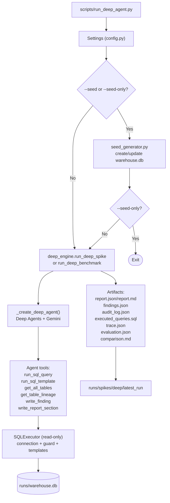
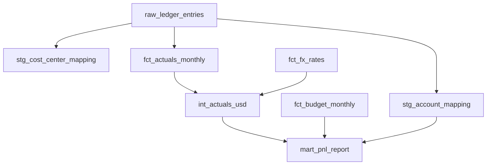
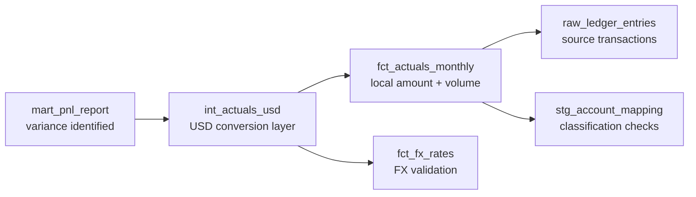

# Variance Analysis Agent (Deep Agent Runtime)

This repository is centered on one runtime path: the Deep Agents execution in `src/va_agent/graph/deep_engine.py`, launched from `scripts/run_deep_agent.py`.

## Scope

- Primary execution path: `scripts/run_deep_agent.py`
- Core runtime: `src/va_agent/graph/deep_engine.py`
- Data store: local SQLite warehouse (`runs/warehouse.db`)
- Agent method: read-only SQL + lineage tracing + finding/report tool writes

The older scaffolding still exists in the codebase for compatibility/testing, but normal operation should use the deep path only.

## Quick Start (uv, recommended)

Prerequisites:

1. Python 3.11-3.13
2. `uv` installed
3. `GOOGLE_API_KEY` set in `.env`

```bash
uv sync --python 3.12 --no-editable
cp .env.example .env
# edit .env and set GOOGLE_API_KEY=...
uv run python scripts/run_deep_agent.py --seed --force-seed --seed-only
uv run python scripts/run_deep_agent.py --repeats 1 --deterministic --verbose
```

## Alternative Setup (venv + pip)

```bash
python3.12 -m venv .venv
source .venv/bin/activate
pip install -r requirements.txt
cp .env.example .env
# edit .env
python scripts/run_deep_agent.py --seed --force-seed --seed-only
python scripts/run_deep_agent.py --repeats 1 --deterministic --verbose
```

## How To Run

Seed only:

```bash
uv run python scripts/run_deep_agent.py --seed --force-seed --seed-only
```

Single deep run:

```bash
uv run python scripts/run_deep_agent.py --repeats 1 --deterministic --verbose
```

Benchmark (multiple deep runs):

```bash
uv run python scripts/run_deep_agent.py --repeats 3 --deterministic --verbose
```

## Script Arguments

| Argument | Description |
|---|---|
| `--seed` | Seed DB before running analysis |
| `--force-seed` | Overwrite existing DB when seeding |
| `--seed-only` | Seed DB and exit without analysis |
| `--repeats N` | Number of runs (`1` single run, `>1` benchmark) |
| `--deterministic` | Force temperature `0.0` |
| `--model MODEL_ID` | Override model name |
| `--db-path PATH` | Override warehouse DB path |
| `--run-label LABEL` | Optional suffix for run directory |
| `--verbose` | Verbose runtime logs |

## Configuration

Environment variables (via `.env` or shell):

| Variable | Default | Description |
|---|---|---|
| `GOOGLE_API_KEY` | - | Required for Gemini calls |
| `VA_MODEL_NAME` | `gemini-3-flash-preview` | Model id |
| `VA_TEMPERATURE` | `0.0` | Sampling temperature |
| `VA_MAX_ROWS` | `500` | Max rows returned per SQL query |
| `VA_QUERY_TIMEOUT` | `30` | SQL timeout in seconds |
| `VA_DB_PATH` | `runs/warehouse.db` | SQLite warehouse path |

If your model is unavailable, set a valid Gemini model id in `VA_MODEL_NAME`.

## Deep Runtime Architecture

### Deep Execution Flow



### Data Lineage DAG



### Deep Investigation Path (Report to Source)



## Output Artifacts

Per deep run (`runs/spikes/deep/<timestamp>[_label]/`):

- `report.json`
- `report.md`
- `findings.json`
- `audit_log.json`
- `executed_queries.sql`
- `trace.json`
- `evaluation.json`
- `comparison.md`

Per benchmark (`runs/spikes/deep/benchmark_<timestamp>/`):

- `benchmark_summary.json`
- `comparison.md`

Pointer to latest deep run:

- `runs/spikes/deep/latest_run`

## What Each Script/Module Does

Module tables below intentionally omit `__init__.py` package marker files.

### Entrypoints

| Path | Purpose | Deep path dependency |
|---|---|---|
| `scripts/run_deep_agent.py` | Main script-first launcher. Parses args, optionally seeds DB, runs deep single/benchmark mode. | Required |
| `src/va_agent/graph/deep_engine.py` | Core Deep Agents runtime, prompt loading, tool wiring, trace/evaluation/artifact writing, benchmark loop. | Required |
| `src/va_agent/cli.py` | Optional Typer CLI (`va`) wrapper around seed/analyze/report/audit commands. | Optional |

### Core Configuration and Models

| Path | Purpose | Deep path dependency |
|---|---|---|
| `src/va_agent/config.py` | Env-backed settings (`VA_*`) and filesystem setup. | Required |
| `src/va_agent/models.py` | Pydantic domain models: findings, report sections, metadata, confidence structures. | Required |

### Data and Lineage

| Path | Purpose | Deep path dependency |
|---|---|---|
| `src/va_agent/data/seed_generator.py` | Builds deterministic synthetic warehouse and injects known anomalies. | Required for local demo data |
| `src/va_agent/data/lineage_registry.py` | Static lineage metadata and upstream/downstream traversal helpers. | Required |

### SQL Runtime

| Path | Purpose | Deep path dependency |
|---|---|---|
| `src/va_agent/sql/connection.py` | Opens read-only SQLite connection with authorizer controls. | Required |
| `src/va_agent/sql/guard.py` | SQL validation/allowlist (`SELECT`/`WITH`), safety checks. | Required |
| `src/va_agent/sql/executor.py` | Executes validated SQL, enforces limits/timeouts, records audit entries. | Required |
| `src/va_agent/sql/templates.py` | Reusable query templates (`variance_summary`, `classification_check`, etc.). | Required |

### Agent Tool Surface

| Path | Purpose | Deep path dependency |
|---|---|---|
| `src/va_agent/tools/sql_tools.py` | Exposes query/template/schema tools to the agent runtime. | Required |
| `src/va_agent/tools/lineage_tools.py` | Exposes table list and lineage traversal tools to the agent runtime. | Required |
| `src/va_agent/tools/report_tools.py` | In-memory finding/section writers consumed by the deep run. | Required |

### Output and Schemas

| Path | Purpose | Deep path dependency |
|---|---|---|
| `src/va_agent/output/writer.py` | Renders report markdown and resolves latest run artifacts. | Required |
| `src/va_agent/output/schemas.py` | Exports and validates JSON schemas for report/finding payloads. | Optional |

### Analysis Utilities (Not on Primary Deep Loop)

| Path | Purpose | Deep path dependency |
|---|---|---|
| `src/va_agent/analysis/confidence.py` | Standalone confidence scoring helpers. | Not required |
| `src/va_agent/analysis/decomposition.py` | Variance decomposition and Pareto driver helpers. | Not required |
| `src/va_agent/analysis/variance.py` | Variance/materiality utility functions. | Not required |

### Prompt Files

| Path | Purpose |
|---|---|
| `src/va_agent/prompts/system.md` | Core role, constraints, and investigation framing |
| `src/va_agent/prompts/hypothesis.md` | Hypothesis generation/testing behavior |
| `src/va_agent/prompts/synthesis.md` | Final finding/report synthesis style |
| `src/va_agent/prompts/deep_spike_agents.md` | Deep-spike-specific memory/instructions |

### Test Scripts

| Path | Purpose |
|---|---|
| `tests/unit/test_deep_engine.py` | Deep runtime behavior and artifacts |
| `tests/unit/test_connection.py` | Read-only DB connection behavior |
| `tests/unit/test_guard.py` | SQL safety guard behavior |
| `tests/unit/test_executor.py` | SQL execution and audit behavior |
| `tests/unit/test_lineage.py` | Lineage metadata correctness |
| `tests/unit/test_models.py` | Pydantic model validation |
| `tests/unit/test_confidence.py` | Confidence scoring utilities |
| `tests/unit/test_decomposition.py` | Decomposition utilities |
| `tests/unit/test_cli_lock.py` | CLI lock-file behavior |
| `tests/integration/test_seed_generator.py` | End-to-end seeding correctness |
| `tests/integration/test_sql_pipeline.py` | SQL stack integration |
| `tests/integration/test_tools.py` | Tool layer integration |
| `tests/regression/test_known_anomalies.py` | Detection against seeded anomaly set |
| `tests/regression/test_runtime_budget.py` | Runtime/performance guardrails |

## Warehouse Database Details

The seeded warehouse contains 8 analytical tables plus `seed_manifest`.

| Table | Layer | Grain | Key Columns | Measures |
|---|---|---|---|---|
| `raw_ledger_entries` | Raw | Journal entry line | `entry_id`, `account_code`, `period`, `cost_center`, `department` | `amount_local` |
| `stg_account_mapping` | Staging | Account code | `account_code` | - |
| `stg_cost_center_mapping` | Staging | Cost center | `cost_center` | - |
| `fct_actuals_monthly` | Fact | Account x Cost Center x Currency x Month | `account_code`, `cost_center`, `currency`, `period` | `amount_local`, `entry_count` |
| `fct_budget_monthly` | Fact | Department x Account Type x Month | `department`, `account_type`, `period` | `budget_amount` |
| `fct_fx_rates` | Fact | Currency x Month | `currency`, `period` | `rate_to_usd` |
| `int_actuals_usd` | Intermediate | Account x Cost Center x Month | `account_code`, `cost_center`, `period` | `amount_usd` |
| `mart_pnl_report` | Mart | Department x Account Type x Month | `department`, `account_type`, `period` | `actual_usd`, `budget_usd`, `variance_usd`, `variance_pct` |

## SQL Safety Model

The deep path enforces read-only access with four layers:

1. SQLite URI read-only mode (`mode=ro`)
2. `PRAGMA query_only=ON`
3. SQLite authorizer allowlist
4. SQL parser guard (`SELECT`/`WITH` only)

## Known Seeded Anomalies

| ID | Category | Injection |
|---|---|---|
| A-001 | COGS anomaly | +25% COGS for `CC-300` in `2024-03` and `2024-04` |
| A-002 | Revenue anomaly | Sales revenue zeroed in `2024-06` |
| A-003 | FX anomaly | EUR rate inflated in `2024-07` |
| A-004 | Budget misalignment | Finance Q3 budget doubled |
| A-005 | Classification error | 50 entries reclassified Revenue -> OpEx |

## Migration (Deep-Agent-Focused)

For full walkthrough, use `migration.md`.

Most important files when adapting to a new database:

1. `src/va_agent/data/lineage_registry.py`
2. `src/va_agent/sql/templates.py`
3. `src/va_agent/tools/sql_tools.py`
4. `src/va_agent/prompts/system.md`
5. `src/va_agent/data/seed_generator.py` (if keeping synthetic seeding)
6. `src/va_agent/sql/connection.py` and `src/va_agent/sql/executor.py` (if changing DB engine)

## Development

Install dependencies:

```bash
uv sync --python 3.12 --no-editable
```

Run tests:

```bash
uv run pytest tests/ -v
uv run pytest tests/unit/ -v
uv run pytest tests/integration/ -v
uv run pytest tests/regression/ -v -m regression
```

## Troubleshooting

| Problem | Fix |
|---|---|
| `ModuleNotFoundError: va_agent` | Use script entrypoint with `uv run python scripts/run_deep_agent.py ...` after `uv sync --python 3.12 --no-editable`. |
| `404 NOT_FOUND` model | Set a valid `VA_MODEL_NAME` for your Gemini API key. |
| `GOOGLE_API_KEY not set` | Add the key to `.env`. |
| `Database not found` | Run `uv run python scripts/run_deep_agent.py --seed --force-seed --seed-only`. |
| Wrong Python selected by `uv` | Pin version: `uv sync --python 3.12`. |

## Related Docs

- `DEEP_ENGINE_TECHNICAL_BACKGROUND.md`
- `migration.md`
- `SPEC.md`
- `AGENTS.md`
