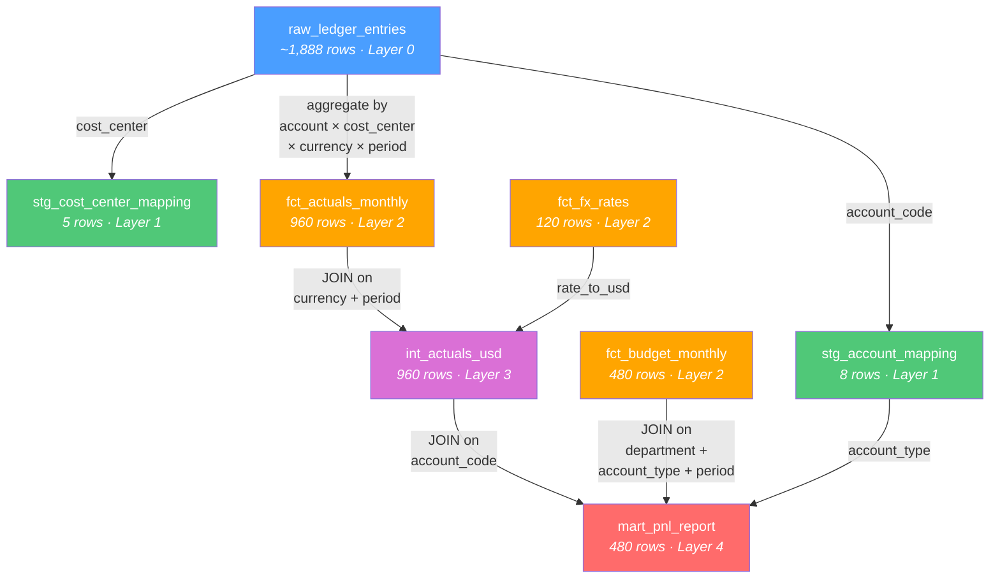
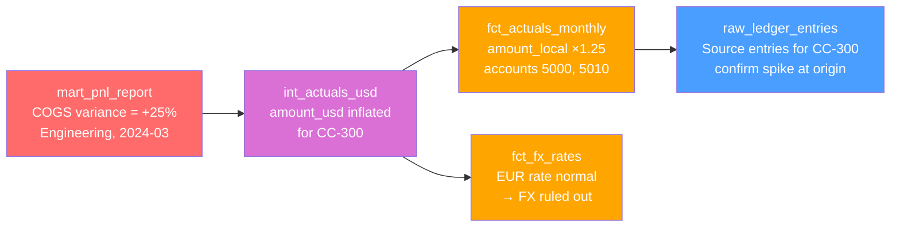

# Variance Analysis Agent

Autonomous variance analysis agent for a local financial warehouse.

The project detects report-level anomalies, traces them upstream across a lineage DAG, tests hypotheses with read-only SQL, and writes confidence-scored findings.

## What This Repo Contains

The repository is now centered on a single runtime approach:

- Deep-agent execution path implemented in `src/va_agent/graph/deep_engine.py`
- Uses `deepagents` + `langchain-google-genai`
- Runtime entry point is `scripts/run_deep_agent.py`

## Quick Start (Recommended: uv)

Prerequisites:
1. Python 3.11-3.13
2. `uv` installed
3. `GOOGLE_API_KEY` (Gemini API key)

Commands:

```bash
uv sync --python 3.12 --no-editable
cp .env.example .env
# edit .env and set GOOGLE_API_KEY=...
uv run python scripts/run_deep_agent.py --seed --force-seed --seed-only
uv run python scripts/run_deep_agent.py --deterministic --verbose
```

## Alternative Setup (venv + pip)

```bash
python3.12 -m venv .venv
source .venv/bin/activate
pip install -r requirements.txt
cp .env.example .env
# edit .env
python scripts/run_deep_agent.py --seed --force-seed --seed-only
python scripts/run_deep_agent.py --deterministic --verbose
```

## Configuration

Environment variables (from `.env` or shell):

| Variable | Default | Description |
|---|---|---|
| `GOOGLE_API_KEY` | - | Required for model calls |
| `VA_MODEL_NAME` | `gemini-3-flash-preview` | Model name |
| `VA_TEMPERATURE` | `0.0` | Sampling temperature |
| `VA_MAX_ROWS` | `500` | Max rows returned by SQL tool |
| `VA_QUERY_TIMEOUT` | `30` | SQL timeout seconds |
| `VA_DB_PATH` | `runs/warehouse.db` | Warehouse database path |

Important model-name note:
- Use bare Gemini model ids like `gemini-3-flash-preview`.
- If you see `404 NOT_FOUND` for model lookup, verify `VA_MODEL_NAME` first.

## Script Arguments

| Argument | Description |
|---|---|
| `--seed` | Seed DB before running analysis |
| `--force-seed` | Overwrite existing DB when seeding |
| `--seed-only` | Seed DB and exit without running analysis |
| `--repeats N` | Number of deep runs (`1` single run, `>1` benchmark) |
| `--deterministic` | Force temperature `0.0` |
| `--model MODEL_ID` | Override model id for this run |
| `--db-path PATH` | Override warehouse DB path |
| `--run-label LABEL` | Add suffix to run directory name |
| `--verbose` | Enable verbose console logs |

## Script-First Execution (Recommended)

Run:

```bash
uv run python scripts/run_deep_agent.py --deterministic --verbose
```

Flow (through `scripts/run_deep_agent.py`):
1. Loads prompts (`system.md`, `hypothesis.md`, `synthesis.md`)
2. Wires SQL executor + tools
3. Runs the Deep Agents runtime with tool-calling
4. Persists report + findings + audit + query log + trace + evaluation

Deep run artifacts are written to:
- `runs/spikes/deep/<timestamp>[_label]/report.json`
- `runs/spikes/deep/<timestamp>[_label]/report.md`
- `runs/spikes/deep/<timestamp>[_label]/findings.json`
- `runs/spikes/deep/<timestamp>[_label]/audit_log.json`
- `runs/spikes/deep/<timestamp>[_label]/executed_queries.sql`
- `runs/spikes/deep/<timestamp>[_label]/trace.json`
- `runs/spikes/deep/<timestamp>[_label]/evaluation.json`
- `runs/spikes/deep/<timestamp>[_label]/comparison.md`

Latest pointer:
- `runs/spikes/deep/latest_run`

## Deep Spike: How To Use

Single deep spike run:

```bash
uv run python scripts/run_deep_agent.py --repeats 1 --deterministic --verbose
```

Benchmark mode (repeated runs):

```bash
uv run python scripts/run_deep_agent.py --repeats 3 --deterministic --verbose
```

Deep spike run artifacts are written to:
- `runs/spikes/deep/<timestamp>[_label]/report.json`
- `runs/spikes/deep/<timestamp>[_label]/report.md`
- `runs/spikes/deep/<timestamp>[_label]/findings.json`
- `runs/spikes/deep/<timestamp>[_label]/audit_log.json`
- `runs/spikes/deep/<timestamp>[_label]/executed_queries.sql`
- `runs/spikes/deep/<timestamp>[_label]/trace.json`
- `runs/spikes/deep/<timestamp>[_label]/evaluation.json`
- `runs/spikes/deep/<timestamp>[_label]/comparison.md`

Benchmark summary output (`--repeats > 1`):
- `runs/spikes/deep/benchmark_<timestamp>/benchmark_summary.json`
- `runs/spikes/deep/benchmark_<timestamp>/comparison.md`

Deep spike technical background:
- `DEEP_ENGINE_TECHNICAL_BACKGROUND.md`

## Deep Runtime Summary

| Dimension | Behavior |
|---|---|
| Orchestration | `deepagents.create_deep_agent` |
| Model client | `ChatGoogleGenerativeAI` |
| Prompt set | `system.md` + `hypothesis.md` + `synthesis.md` + optional `deep_spike_agents.md` |
| Failure behavior | Fallback path ensures at least one finding and one section |
| Evaluation output | `evaluation.json` + `comparison.md` per run; benchmark summary for repeats |
| Output root | `runs/spikes/deep/...` |

## Architecture

### Data Lineage DAG

```text
raw_ledger_entries (raw)
|- stg_account_mapping (staging)
|- stg_cost_center_mapping (staging)
`- fct_actuals_monthly (fact)
      `- int_actuals_usd (intermediate)  <- fct_fx_rates (fact)
            `- mart_pnl_report (mart)    <- fct_budget_monthly (fact)
                                          <- stg_account_mapping
```

The agent starts at `mart_pnl_report` and traces anomalies upstream to isolate root cause origin.

### Agent Methodology

| Phase | What happens |
|---|---|
| Orientation | Scan tables, run variance summary, rank material anomalies |
| Hypothesis | Form explicit root-cause hypotheses |
| Deep Dive | Execute SQL tests and traverse lineage upstream |
| Synthesis | Write confidence-scored findings and report sections |

## Warehouse Database Details

The seeded `warehouse.db` has 8 analytical tables plus `seed_manifest`.

### Layer 0 - Raw

`raw_ledger_entries` (~1,888 rows): raw journal entry lines.

| Column | Type | Description |
|---|---|---|
| `entry_id` | INTEGER | Unique journal entry identifier |
| `period` | TEXT | Month in `YYYY-MM` format |
| `account_code` | TEXT | Account code (`4000`, `4010`, `5000`, `5010`, `6000`, `6010`, `6020`, `7000`) |
| `account_type` | TEXT | Account classification (`Revenue`, `COGS`, `OpEx`, `Depreciation`) |
| `department` | TEXT | Department (`Sales`, `Marketing`, `Engineering`, `Finance`, `Operations`) |
| `cost_center` | TEXT | Cost center code (`CC-100` through `CC-500`) |
| `currency` | TEXT | Transaction currency (`USD`, `EUR`, `GBP`, `JPY`, `CAD`) |
| `segment` | TEXT | Business segment (`Enterprise`, `SMB`, `Consumer`) |
| `country` | TEXT | Country of origin (`USA`, `Germany`, `UK`, `Japan`, `Canada`) |
| `product` | TEXT | Product line (`Product A` through `Product D`) |
| `amount_local` | REAL | Amount in local currency |
| `description` | TEXT | Journal entry description |
| `posted_date` | TEXT | Posting date (`YYYY-MM-DD`) |

### Layer 1 - Staging

`stg_account_mapping` (8 rows): account code mapping.

| Column | Type | Description |
|---|---|---|
| `account_code` | TEXT | Primary key |
| `account_type` | TEXT | Account classification |
| `account_name` | TEXT | Human-readable account name |

`stg_cost_center_mapping` (5 rows): cost center mapping.

| Column | Type | Description |
|---|---|---|
| `cost_center` | TEXT | Primary key |
| `department` | TEXT | Department |
| `region` | TEXT | Region |

### Layer 2 - Facts

`fct_actuals_monthly` (960 rows): aggregated actuals.

| Column | Type | Description |
|---|---|---|
| `account_code` | TEXT | FK to account mapping |
| `cost_center` | TEXT | FK to cost center mapping |
| `currency` | TEXT | FK to FX rates |
| `period` | TEXT | Month `YYYY-MM` |
| `department` | TEXT | Department |
| `amount_local` | REAL | Local amount |
| `entry_count` | INTEGER | Aggregated journal-entry count |

`fct_budget_monthly` (480 rows): monthly budget.

| Column | Type | Description |
|---|---|---|
| `department` | TEXT | Department |
| `account_type` | TEXT | Account classification |
| `period` | TEXT | Month `YYYY-MM` |
| `budget_amount` | REAL | Budget amount in USD |

`fct_fx_rates` (120 rows): monthly FX rates.

| Column | Type | Description |
|---|---|---|
| `currency` | TEXT | Currency code |
| `period` | TEXT | Month `YYYY-MM` |
| `rate_to_usd` | REAL | Local-to-USD multiplier |

### Layer 3 - Intermediate

`int_actuals_usd` (960 rows): USD-converted actuals.

| Column | Type | Description |
|---|---|---|
| `account_code` | TEXT | Account code |
| `cost_center` | TEXT | Cost center |
| `department` | TEXT | Department |
| `period` | TEXT | Month `YYYY-MM` |
| `amount_usd` | REAL | Converted USD amount |

### Layer 4 - Mart

`mart_pnl_report` (480 rows): final P&L report.

| Column | Type | Description |
|---|---|---|
| `department` | TEXT | Department |
| `account_type` | TEXT | Account classification |
| `period` | TEXT | Month `YYYY-MM` |
| `actual_usd` | REAL | Actual amount in USD |
| `budget_usd` | REAL | Budget amount in USD |
| `variance_usd` | REAL | `actual_usd - budget_usd` |
| `variance_pct` | REAL | Variance as budget percentage |

### Table Relationships

```text
mart_pnl_report.department -> fct_budget_monthly.department
mart_pnl_report.account_type -> fct_budget_monthly.account_type
mart_pnl_report.account_type -> stg_account_mapping.account_type

int_actuals_usd.account_code -> fct_actuals_monthly.account_code
int_actuals_usd.cost_center -> fct_actuals_monthly.cost_center
int_actuals_usd.period -> fct_fx_rates.period (+ currency)

fct_actuals_monthly.account_code -> stg_account_mapping.account_code
fct_actuals_monthly.cost_center -> stg_cost_center_mapping.cost_center
fct_actuals_monthly.account_code -> raw_ledger_entries.account_code
fct_actuals_monthly.period -> raw_ledger_entries.period
```

### Lineage Query Examples

1. Trace a variance from mart to raw:

```sql
SELECT department, account_type, period, variance_usd, variance_pct
FROM mart_pnl_report
ORDER BY ABS(variance_usd) DESC
LIMIT 5;

SELECT account_code, cost_center, period, amount_usd
FROM int_actuals_usd
WHERE department = 'Engineering' AND period = '2024-03';

SELECT a.account_code, a.cost_center, a.amount_local, a.currency,
       f.rate_to_usd, ROUND(a.amount_local * f.rate_to_usd, 2) AS computed_usd
FROM fct_actuals_monthly a
JOIN fct_fx_rates f ON a.currency = f.currency AND a.period = f.period
WHERE a.cost_center = 'CC-300' AND a.period = '2024-03';

SELECT entry_id, account_code, account_type, amount_local, description
FROM raw_ledger_entries
WHERE cost_center = 'CC-300' AND period = '2024-03'
  AND account_code IN ('5000', '5010')
ORDER BY amount_local DESC;
```

2. Classification mismatches:

```sql
SELECT r.account_code,
       r.account_type AS ledger_type,
       m.account_type AS mapping_type,
       COUNT(*) AS entry_count,
       ROUND(SUM(r.amount_local), 2) AS total_amount
FROM raw_ledger_entries r
JOIN stg_account_mapping m ON r.account_code = m.account_code
WHERE r.account_type != m.account_type
GROUP BY r.account_code, r.account_type, m.account_type
ORDER BY entry_count DESC;
```

3. FX trend:

```sql
SELECT currency, period, rate_to_usd,
       LAG(rate_to_usd) OVER (PARTITION BY currency ORDER BY period) AS prev_rate,
       ROUND(
           (rate_to_usd - LAG(rate_to_usd) OVER (PARTITION BY currency ORDER BY period))
           / LAG(rate_to_usd) OVER (PARTITION BY currency ORDER BY period) * 100,
           2
       ) AS pct_change
FROM fct_fx_rates
WHERE currency = 'EUR'
ORDER BY period;
```

4. Budget vs actual with rolling average:

```sql
SELECT department, account_type, period,
       actual_usd, budget_usd, variance_usd,
       ROUND(AVG(budget_usd) OVER (
           PARTITION BY department, account_type
           ORDER BY period
           ROWS BETWEEN 3 PRECEDING AND 1 PRECEDING
       ), 2) AS rolling_avg_budget
FROM mart_pnl_report
WHERE department = 'Finance'
ORDER BY account_type, period;
```

### Data Lineage Diagram



### Agent Methodology Diagram


### Upstream Trace Example



## SQL Safety

The project enforces read-only behavior with 4 layers:

| Layer | Mechanism | Enforcement |
|---|---|---|
| 1 | SQLite URI `mode=ro` | Connection-level read-only |
| 2 | `PRAGMA query_only=ON` | Session-level read-only |
| 3 | SQLite `set_authorizer` | Per-operation allowlist |
| 4 | `sqlparse` guard | Statement allowlist (`SELECT`/`WITH`) + blacklist |

## Seeded Anomalies

| ID | Category | Injection |
|---|---|---|
| A-001 | COGS Anomaly | +25% COGS for `CC-300` in `2024-03` and `2024-04` |
| A-002 | Revenue Anomaly | Sales revenue zeroed in `2024-06` |
| A-003 | FX Anomaly | EUR rate inflated in `2024-07` |
| A-004 | Budget Misalignment | Finance Q3 budget doubled |
| A-005 | Classification Error | 50 entries reclassified Revenue -> OpEx |

## Confidence Scoring

Weighted score:
- Evidence breadth: 25%
- Lineage depth: 20%
- Variance explanation: 25%
- Hypothesis exclusion: 15%
- Data quality: 10%
- Temporal consistency: 5%

Levels:
- HIGH: >= 0.70
- MEDIUM: >= 0.40
- LOW: < 0.40

## Project Structure

```text
src/va_agent/
  cli.py
  config.py
  models.py
  data/
    seed_generator.py
    lineage_registry.py
  sql/
    connection.py
    guard.py
    executor.py
    templates.py
  tools/
    sql_tools.py
    lineage_tools.py
    report_tools.py
  graph/
    deep_engine.py
  output/
    writer.py
  prompts/
    system.md
    hypothesis.md
    synthesis.md
```

Other key docs:
- `SPEC.md`
- `AGENTS.md`
- `migration.md`
- `DEEP_ENGINE_TECHNICAL_BACKGROUND.md`

## Migration Guide

For full migration walkthrough to a new database/schema, use:
- `migration.md`

Core files to modify during migration:
1. `src/va_agent/data/lineage_registry.py`
2. `src/va_agent/sql/templates.py`
3. `src/va_agent/tools/sql_tools.py`
4. `src/va_agent/prompts/system.md`
5. `AGENTS.md`
6. `src/va_agent/data/seed_generator.py` (if keeping synthetic seeding)
7. `tests/*`
8. `README.md` and `SPEC.md`

If migrating away from SQLite, also modify:
1. `src/va_agent/sql/connection.py`
2. `src/va_agent/sql/executor.py`
3. `src/va_agent/sql/guard.py`

## Deep Agent Customization Guide

If you want to change deep spike behavior, start here:

1. Prompt and task shape:
- `src/va_agent/graph/deep_engine.py` (`_load_spike_prompt`, strict `user_message`)
- `src/va_agent/prompts/deep_spike_agents.md` (if present)

2. Tool exposure:
- `src/va_agent/graph/deep_engine.py` (`_create_deep_agent` tool list)

3. Runtime knobs:
- `_DEFAULT_DEEP_REQUEST_TIMEOUT_S`
- `_DEFAULT_DEEP_RETRIES`
- `_DEFAULT_DEEP_RECURSION_LIMIT`
- `--repeats`, `--deterministic`, `--model`, `--db-path`

4. Evaluation criteria:
- `_ANOMALY_RULES`
- `evaluate_findings()`
- `_build_comparison_markdown()`

5. Artifact contract:
- `_write_artifacts()`

## Development

Install deps:

```bash
uv sync --python 3.12 --no-editable
```

Run analysis without CLI install:

```bash
uv run python scripts/run_deep_agent.py --deterministic --verbose
```

Run tests:

```bash
uv run pytest tests/ -v
uv run pytest tests/unit/ -v
uv run pytest tests/integration/ -v
uv run pytest tests/regression/ -v -m regression
uv run pytest tests/ --cov=va_agent --cov-report=term-missing
```

Re-seed deterministic DB:

```bash
uv run python scripts/run_deep_agent.py --seed --force-seed --seed-only
```

## Troubleshooting

| Problem | Fix |
|---|---|
| `ModuleNotFoundError: va_agent` | Use script entrypoint and sync deps: `uv sync --python 3.12 --no-editable` then `uv run python scripts/run_deep_agent.py ...` |
| `404 NOT_FOUND` model | Set valid `VA_MODEL_NAME` like `gemini-3-flash-preview` |
| `GOOGLE_API_KEY not set` | Create `.env` and set key |
| `Database not found` | Run `uv run python scripts/run_deep_agent.py --seed --force-seed --seed-only` or pass `--db-path` |
| `uv sync` picks unsupported Python | Pin Python: `uv sync --python 3.12` |
| PowerShell activation blocked | `Set-ExecutionPolicy -Scope CurrentUser RemoteSigned` |

## Tech Stack

| Component | Technology |
|---|---|
| Agent orchestration | `deepagents` (LangGraph-based) |
| LLM providers | Gemini via `langchain-google-genai` |
| Database | SQLite |
| Execution entrypoint | `scripts/run_deep_agent.py` + `argparse` |
| Validation | Pydantic v2 + sqlparse |
| Data generation | pandas + numpy |
