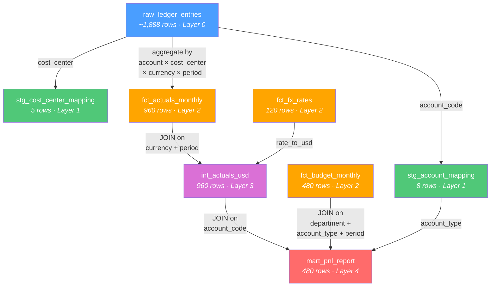
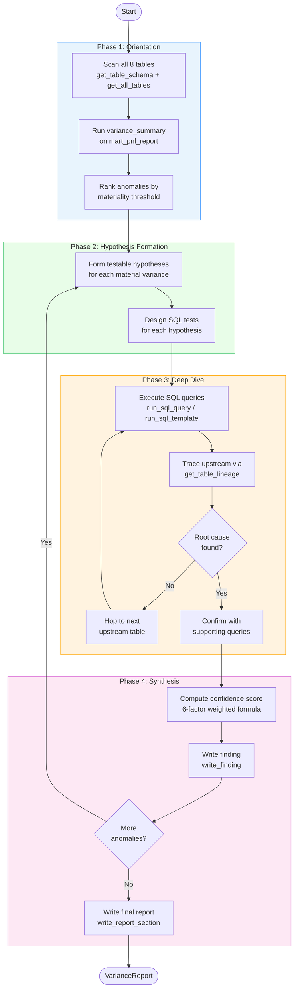
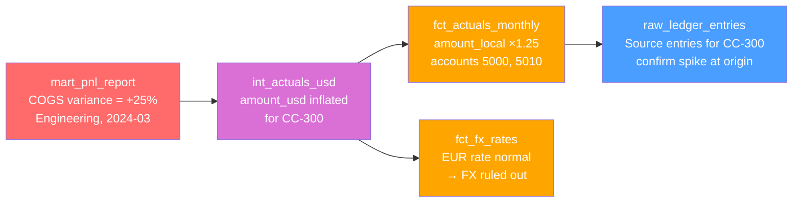

# Variance Analysis Agent

Autonomous variance analysis agent that starts from report-level anomalies, traverses upstream multi-hop SQL lineage, forms and tests hypotheses via controlled SQL, and produces confidence-scored root-cause findings.

Powered by **Google Gemini** (GenAI API) and **deepagents** (LangGraph).

---

## Quick Start

> Every command below is shown for **PowerShell** and **Bash** (Git Bash / WSL).
> Pick whichever shell you use — the pipeline is identical.

### Option A — Using uv (recommended)

**PowerShell:**

```powershell
uv sync                                # 1. create venv + install deps
Copy-Item .env.example .env            # 2. copy env template, then edit .env
uv run va seed                         # 3. generate the warehouse database
uv run va analyze --verbose            # 4. run the agent (needs GOOGLE_API_KEY)
uv run va report                       # 5. write report artifacts
uv run va audit                        # 6. view executed SQL queries
```

**Bash:**

```bash
uv sync                                # 1. create venv + install deps
cp .env.example .env                   # 2. copy env template, then edit .env
uv run va seed                         # 3. generate the warehouse database
uv run va analyze --verbose            # 4. run the agent (needs GOOGLE_API_KEY)
uv run va report                       # 5. write report artifacts
uv run va audit                        # 6. view executed SQL queries
```

### Option B — Using classic venv + pip

**PowerShell:**

```powershell
python -m venv .venv                   # 1. create virtual environment
.venv\Scripts\Activate.ps1             # 2. activate it
pip install -r requirements.txt        # 3. install dependencies
pip install -e .                       # 4. install the project (editable)
Copy-Item .env.example .env            # 5. copy env template, then edit .env
va seed                                # 6. generate the warehouse database
va analyze --verbose                   # 7. run the agent (needs GOOGLE_API_KEY)
va report                              # 8. write report artifacts
va audit                               # 9. view executed SQL queries
```

**Bash:**

```bash
python3 -m venv .venv                  # 1. create virtual environment
source .venv/bin/activate              # 2. activate it (use .venv/Scripts/activate on Git Bash)
pip install -r requirements.txt        # 3. install dependencies
pip install -e .                       # 4. install the project (editable)
cp .env.example .env                   # 5. copy env template, then edit .env
va seed                                # 6. generate the warehouse database
va analyze --verbose                   # 7. run the agent (needs GOOGLE_API_KEY)
va report                              # 8. write report artifacts
va audit                               # 9. view executed SQL queries
```

---

## Full Setup Guide

> This guide offers two setup paths: **uv** (recommended, faster) and **classic venv + pip**.
> Pick one and follow its steps — both produce the same result.

### Step 1 — Install your package manager

#### Option A — uv (recommended)

uv is a fast Python package and project manager. If you don't have it yet:

**PowerShell:**

```powershell
irm https://astral.sh/uv/install.ps1 | iex
```

**Bash (Git Bash / WSL):**

```bash
curl -LsSf https://astral.sh/uv/install.sh | sh
```

Confirm it installed (works in both shells):

```
uv --version
# uv 0.9.x
```

> If `uv` is not on your PATH after installing, close and reopen your terminal.

#### Option B — Classic venv + pip

No extra tooling needed — just ensure you have **Python 3.11–3.13** installed:

```
python --version
# Python 3.12.x
```

> On Linux / macOS you may need to use `python3` instead of `python`.

### Step 2 — Clone the repository

Works the same in both shells:

```
git clone <repo-url> varanalyise_cl
cd varanalyise_cl
```

### Step 3 — Create the virtual environment and install dependencies

#### Option A — uv

Works the same in both shells:

```
uv sync
```

This single command:

- Creates a `.venv\` directory with Python 3.12
- Resolves and installs all 72 dependencies (deepagents, langchain-google-genai, pandas, pydantic, etc.)
- Installs the project itself so the `va` CLI is available

You should see output ending with:

```
Installed 72 packages in 1.2s
 + va-agent==0.1.0 (from file:///...)
```

> If uv picks Python 3.14 instead of 3.12, run `uv sync --python 3.12`.

#### Option B — Classic venv + pip

**PowerShell:**

```powershell
python -m venv .venv
.venv\Scripts\Activate.ps1
pip install -r requirements.txt
pip install -e .
```

**Bash (Git Bash / WSL):**

```bash
python3 -m venv .venv
source .venv/bin/activate              # WSL / Linux / macOS
# or: source .venv/Scripts/activate    # Git Bash on Windows
pip install -r requirements.txt
pip install -e .
```

> If you get a script execution error on PowerShell, run `Set-ExecutionPolicy -Scope CurrentUser RemoteSigned` first.

The `pip install -e .` step installs the project in editable mode and registers the `va` CLI command.

### Step 4 — Activate the virtual environment

> If you used **Option B** above, the venv is already activated. Skip to Step 5.

**PowerShell:**

```powershell
.venv\Scripts\Activate.ps1
```

> If you get a script execution error, run `Set-ExecutionPolicy -Scope CurrentUser RemoteSigned` first.

**Bash (Git Bash / WSL):**

```bash
source .venv/Scripts/activate    # Git Bash on Windows
# or
source .venv/bin/activate        # WSL / Linux / macOS
```

Once activated your prompt will show `(.venv)` or `(va-agent)`. The `va` command is now available directly.

> **Alternative (uv only):** skip activation entirely and prefix every command with `uv run`. For example `uv run va seed` instead of `va seed`. Both work identically.

### Step 5 — Set up your Google API key

Get a free Gemini API key at **https://aistudio.google.com/apikey**.

Create the `.env` file from the template:

**PowerShell:**

```powershell
Copy-Item .env.example .env
```

**Bash:**

```bash
cp .env.example .env
```

Open `.env` in any editor and replace the placeholder:

```
GOOGLE_API_KEY=AIzaSy...your-actual-key...
```

You can also open it quickly from the terminal:

**PowerShell:**

```powershell
notepad .env
```

**Bash:**

```bash
nano .env       # or code .env, vim .env, etc.
```

### Step 6 — Seed the warehouse database

Works the same in both shells:

```
uv run va seed
```

This generates `runs/warehouse.db` — a SQLite database with 8 analytical tables, ~1,900 journal entries of synthetic financial data, and 5 intentionally injected anomalies.

Expected output:

```
Seeding warehouse database...
         Warehouse Tables
+--------------------------------+
| Table                   | Rows |
|-------------------------+------|
| raw_ledger_entries      | 1888 |
| stg_account_mapping     |    8 |
| stg_cost_center_mapping |    5 |
| fct_actuals_monthly     |  960 |
| fct_budget_monthly      |  480 |
| fct_fx_rates            |  120 |
| int_actuals_usd         |  960 |
| mart_pnl_report         |  480 |
| seed_manifest           |    5 |
+--------------------------------+

Database created: runs\warehouse.db
Checksum: 20a765fc756f
```

To regenerate from scratch: `uv run va seed --force`

### Step 7 — Run the analysis agent

Works the same in both shells:

```
uv run va analyze --verbose
```

The agent autonomously:

1. **Orients** — scans all 8 tables, runs a variance summary, identifies the biggest anomalies
2. **Hypothesizes** — forms testable hypotheses about each material variance
3. **Investigates** — executes SQL queries against the warehouse, traces upstream through the lineage DAG
4. **Synthesizes** — writes confidence-scored findings and a structured report

Results are saved to `runs/<timestamp>/report.json`.

### Step 8 — Generate output reports

```
uv run va report
```

Reads the latest analysis run and writes 5 artifacts into the run directory:

| File | What it contains |
|------|------------------|
| `report.json` | Full structured report (Pydantic-validated JSON) |
| `report.md` | Human-readable markdown version |
| `findings.json` | Just the findings array |
| `executed_queries.sql` | Every SQL query the agent ran, with timing |
| `run_log.json` | Execution metadata + full audit trail |

### Step 9 — View the query audit log

```
uv run va audit
```

Prints a table of every SQL query the agent executed, with execution time and row counts.

---

## Project Structure

```
varanalyise_cl\
├── src\va_agent\
│   ├── cli.py                  # Typer CLI (seed, analyze, report, audit)
│   ├── config.py               # Settings via env vars (VA_ prefix)
│   ├── models.py               # Pydantic models (Finding, VarianceReport, etc.)
│   ├── data\
│   │   ├── seed_generator.py   # Data pipeline: generate → inject anomalies → SQLite
│   │   └── lineage_registry.py # Static lineage DAG + traversal helpers
│   ├── sql\
│   │   ├── connection.py       # 3-layer read-only SQLite connection
│   │   ├── guard.py            # sqlparse whitelist — only SELECT allowed
│   │   ├── executor.py         # Validate → execute → audit
│   │   └── templates.py        # 7 parameterized SQL templates
│   ├── tools\
│   │   ├── sql_tools.py        # run_sql_query, run_sql_template, get_table_schema
│   │   ├── lineage_tools.py    # get_table_lineage, get_all_tables
│   │   └── report_tools.py     # write_finding, write_report_section
│   ├── graph\
│   │   ├── build.py            # Wires deepagents + tools + prompts → agent
│   │   └── state.py            # AnalysisState TypedDict
│   ├── analysis\
│   │   ├── variance.py         # compute_variance, materiality_threshold
│   │   ├── decomposition.py    # Pareto driver identification
│   │   └── confidence.py       # Weighted 6-factor confidence scoring
│   ├── output\
│   │   ├── writer.py           # ReportWriter (JSON, MD, SQL, log)
│   │   └── schemas.py          # JSON Schema export
│   └── prompts\
│       ├── system.md           # 4-phase methodology
│       ├── hypothesis.md       # Hypothesis testing framework
│       └── synthesis.md        # Report synthesis instructions
├── tests\
│   ├── unit\                   # 83 unit tests
│   ├── integration\            # 28 integration tests
│   └── regression\             # 8 regression tests (anomaly detection)
├── runs\                       # Generated databases + analysis outputs
├── AGENTS.md                   # Agent memory (loaded by deepagents)
├── SKILLS.md                   # 6 reusable analysis skills
├── SPEC.md                     # Full technical specification
├── pyproject.toml              # Project config + dependencies
├── requirements.txt            # pip-compatible runtime dependencies
├── requirements-dev.txt        # pip-compatible dev dependencies (includes runtime)
└── .env.example                # Environment variable template
```

---

## CLI Reference

| Command | Description |
|---------|-------------|
| `va seed [--force] [--db-path PATH]` | Seed the warehouse database. `--force` overwrites existing. |
| `va analyze [--model M] [--verbose] [--db-path PATH]` | Run the analysis agent. `--model` overrides the LLM. |
| `va report [--run-dir DIR]` | Write output artifacts from the latest run. |
| `va audit [--run-dir DIR]` | Print the SQL query audit log. |

All commands work identically in PowerShell and Bash. Prefix with `uv run` if the venv is not activated.

---

## Architecture

### Data Lineage DAG

```
raw_ledger_entries (raw)
├─► stg_account_mapping (staging)
├─► stg_cost_center_mapping (staging)
└─► fct_actuals_monthly (fact)
      └─► int_actuals_usd (intermediate)  ◄── fct_fx_rates (fact)
            └─► mart_pnl_report (mart)    ◄── fct_budget_monthly (fact)
                                          ◄── stg_account_mapping
```

The agent starts at `mart_pnl_report` and traces anomalies **upstream** through the DAG until it reaches the layer where the issue originates.

### Agent Methodology

| Phase | What happens |
|-------|-------------|
| 1. Orientation | Scan all tables, run variance summary, rank anomalies |
| 2. Hypothesis | Form testable hypotheses for each material variance |
| 3. Deep Dive | SQL queries + upstream lineage traversal to confirm/refute |
| 4. Synthesis | Write confidence-scored findings + structured report |

---

## Technical Details

### Warehouse Database Schema

The `warehouse.db` contains 8 analytical tables organized in a 5-layer lineage model, plus a `seed_manifest` table documenting injected anomalies.

#### Layer 0 — Raw

**`raw_ledger_entries`** (~1,888 rows) — Raw journal entries from source ledgers.

| Column | Type | Description |
|--------|------|-------------|
| `entry_id` | INTEGER | Unique journal entry identifier |
| `period` | TEXT | Month in `YYYY-MM` format |
| `account_code` | TEXT | Account code (`4000`, `4010`, `5000`, `5010`, `6000`, `6010`, `6020`, `7000`) |
| `account_type` | TEXT | Account classification (`Revenue`, `COGS`, `OpEx`, `Depreciation`) |
| `department` | TEXT | Department (`Sales`, `Marketing`, `Engineering`, `Finance`, `Operations`) |
| `cost_center` | TEXT | Cost center code (`CC-100` through `CC-500`) |
| `currency` | TEXT | Transaction currency (`USD`, `EUR`, `GBP`, `JPY`, `CAD`) |
| `segment` | TEXT | Business segment (`Enterprise`, `SMB`, `Consumer`) |
| `country` | TEXT | Country of origin (`USA`, `Germany`, `UK`, `Japan`, `Canada`) |
| `product` | TEXT | Product line (`Product A` through `Product D`) |
| `amount_local` | REAL | Amount in local currency |
| `description` | TEXT | Journal entry description |
| `posted_date` | TEXT | Posting date (`YYYY-MM-DD`) |

#### Layer 1 — Staging

**`stg_account_mapping`** (8 rows) — Maps account codes to types and names.

| Column | Type | Description |
|--------|------|-------------|
| `account_code` | TEXT | Primary key — account code |
| `account_type` | TEXT | Account classification |
| `account_name` | TEXT | Human-readable name (e.g., `Product Revenue`, `Direct Materials`) |

**`stg_cost_center_mapping`** (5 rows) — Maps cost centers to departments and regions.

| Column | Type | Description |
|--------|------|-------------|
| `cost_center` | TEXT | Primary key — cost center code |
| `department` | TEXT | Department name |
| `region` | TEXT | Geographic region |

#### Layer 2 — Facts

**`fct_actuals_monthly`** (960 rows) — Aggregated monthly actuals from the raw ledger.

| Column | Type | Description |
|--------|------|-------------|
| `account_code` | TEXT | Account code (FK → `stg_account_mapping`) |
| `cost_center` | TEXT | Cost center (FK → `stg_cost_center_mapping`) |
| `currency` | TEXT | Transaction currency (FK → `fct_fx_rates`) |
| `period` | TEXT | Month (`YYYY-MM`) |
| `department` | TEXT | Department |
| `amount_local` | REAL | Sum of local currency amounts |
| `entry_count` | INTEGER | Number of journal entries aggregated |

**`fct_budget_monthly`** (480 rows) — Monthly budget amounts by department.

| Column | Type | Description |
|--------|------|-------------|
| `department` | TEXT | Department name |
| `account_type` | TEXT | Account classification |
| `period` | TEXT | Month (`YYYY-MM`) |
| `budget_amount` | REAL | Budgeted amount in USD |

**`fct_fx_rates`** (120 rows) — Monthly exchange rates to USD.

| Column | Type | Description |
|--------|------|-------------|
| `currency` | TEXT | Currency code |
| `period` | TEXT | Month (`YYYY-MM`) |
| `rate_to_usd` | REAL | Exchange rate (multiply local amount to get USD) |

#### Layer 3 — Intermediate

**`int_actuals_usd`** (960 rows) — Actuals converted to USD using FX rates.

| Column | Type | Description |
|--------|------|-------------|
| `account_code` | TEXT | Account code |
| `cost_center` | TEXT | Cost center |
| `department` | TEXT | Department |
| `period` | TEXT | Month (`YYYY-MM`) |
| `amount_usd` | REAL | Amount converted to USD |

#### Layer 4 — Mart

**`mart_pnl_report`** (480 rows) — Final P&L report comparing actuals vs budget.

| Column | Type | Description |
|--------|------|-------------|
| `department` | TEXT | Department name |
| `account_type` | TEXT | Account classification |
| `period` | TEXT | Month (`YYYY-MM`) |
| `actual_usd` | REAL | Actual amount in USD |
| `budget_usd` | REAL | Budget amount in USD |
| `variance_usd` | REAL | `actual_usd - budget_usd` |
| `variance_pct` | REAL | Variance as percentage of budget |

### Table Relationships

Tables are connected through shared key columns. The agent traces anomalies upstream through these joins:

```
mart_pnl_report.department ──────────────► fct_budget_monthly.department
mart_pnl_report.account_type ────────────► fct_budget_monthly.account_type
mart_pnl_report.account_type ────────────► stg_account_mapping.account_type

int_actuals_usd.account_code ────────────► fct_actuals_monthly.account_code
int_actuals_usd.cost_center ─────────────► fct_actuals_monthly.cost_center
int_actuals_usd.period ──────────────────► fct_fx_rates.period (+ currency)

fct_actuals_monthly.account_code ────────► stg_account_mapping.account_code
fct_actuals_monthly.cost_center ─────────► stg_cost_center_mapping.cost_center
fct_actuals_monthly.account_code ────────► raw_ledger_entries.account_code
fct_actuals_monthly.period ──────────────► raw_ledger_entries.period
```

### Lineage Query Examples

**1. Trace a variance from the P&L mart down to raw journal entries (3-hop join):**

```sql
-- Start at mart: find the largest variance
SELECT department, account_type, period, variance_usd, variance_pct
FROM mart_pnl_report
ORDER BY ABS(variance_usd) DESC
LIMIT 5;

-- Hop 1: drill into USD actuals for that department
SELECT account_code, cost_center, period, amount_usd
FROM int_actuals_usd
WHERE department = 'Engineering' AND period = '2024-03';

-- Hop 2: check local currency amounts + FX rate used
SELECT a.account_code, a.cost_center, a.amount_local, a.currency,
       f.rate_to_usd, ROUND(a.amount_local * f.rate_to_usd, 2) AS computed_usd
FROM fct_actuals_monthly a
JOIN fct_fx_rates f ON a.currency = f.currency AND a.period = f.period
WHERE a.cost_center = 'CC-300' AND a.period = '2024-03';

-- Hop 3: inspect individual journal entries at the source
SELECT entry_id, account_code, account_type, amount_local, description
FROM raw_ledger_entries
WHERE cost_center = 'CC-300' AND period = '2024-03'
  AND account_code IN ('5000', '5010')
ORDER BY amount_local DESC;
```

**2. Detect classification mismatches (ledger vs mapping JOIN):**

```sql
-- Entries where ledger account_type disagrees with the master mapping
SELECT r.account_code,
       r.account_type AS ledger_type,
       m.account_type AS mapping_type,
       COUNT(*)        AS entry_count,
       ROUND(SUM(r.amount_local), 2) AS total_amount
FROM raw_ledger_entries r
JOIN stg_account_mapping m ON r.account_code = m.account_code
WHERE r.account_type != m.account_type
GROUP BY r.account_code, r.account_type, m.account_type
ORDER BY entry_count DESC;
```

**3. FX rate trend analysis with period-over-period change:**

```sql
SELECT currency, period, rate_to_usd,
       LAG(rate_to_usd) OVER (PARTITION BY currency ORDER BY period) AS prev_rate,
       ROUND(
           (rate_to_usd - LAG(rate_to_usd) OVER (PARTITION BY currency ORDER BY period))
           / LAG(rate_to_usd) OVER (PARTITION BY currency ORDER BY period) * 100,
           2
       ) AS pct_change
FROM fct_fx_rates
WHERE currency = 'EUR'
ORDER BY period;
```

**4. Budget vs actual with rolling average comparison:**

```sql
SELECT department, account_type, period,
       actual_usd, budget_usd, variance_usd,
       ROUND(AVG(budget_usd) OVER (
           PARTITION BY department, account_type
           ORDER BY period
           ROWS BETWEEN 3 PRECEDING AND 1 PRECEDING
       ), 2) AS rolling_avg_budget
FROM mart_pnl_report
WHERE department = 'Finance'
ORDER BY account_type, period;
```

### Data Lineage Diagram



### Agent Methodology Diagram



### Upstream Trace Example

When the agent detects a large COGS variance in `mart_pnl_report`, it follows this path:



At each hop the agent:
1. Queries the current table to quantify the variance
2. Checks each upstream source to isolate which input causes the anomaly
3. Rules out alternative explanations (e.g., FX rate change vs actual amount change)
4. Continues upstream until it reaches the layer where the data was originally modified

---

## SQL Safety

4-layer read-only defense — the agent cannot modify data:

| Layer | Mechanism | Enforcement |
|-------|-----------|-------------|
| 1 | SQLite URI `mode=ro` | Connection refuses writes at open time |
| 2 | `PRAGMA query_only=ON` | Runtime enforcement at session level |
| 3 | `set_authorizer` callback | Per-operation check (only READ/SELECT/FUNCTION) |
| 4 | `sqlparse` guard | Statement-level: only `SELECT`/`WITH`, blocks 22 dangerous keywords |

---

## Seeded Anomalies

The database ships with 5 known anomalies for testing and benchmarking:

| ID | Category | What was injected |
|----|----------|-------------------|
| A-001 | COGS Anomaly | +25% COGS in cost center CC-300 for 2024-03 and 2024-04 |
| A-002 | Revenue Anomaly | Revenue zeroed for Sales department in 2024-06 |
| A-003 | FX Anomaly | EUR/USD rate inflated 15% above trend in 2024-07 |
| A-004 | Budget Misalignment | Finance department Q3 2024 budget doubled |
| A-005 | Classification Error | 50 journal entries reclassified from Revenue to OpEx |

---

## Confidence Scoring

Every finding gets a weighted composite score:

| Factor | Weight | What it measures |
|--------|--------|------------------|
| Evidence Breadth | 25% | How many independent queries support it |
| Lineage Depth | 20% | How far upstream the trace went (raw = 1.0) |
| Variance Explanation | 25% | What fraction of the variance is explained |
| Hypothesis Exclusion | 15% | How many alternatives were ruled out |
| Data Quality | 10% | Quality of the underlying data |
| Temporal Consistency | 5% | Whether the pattern holds across time |

**Levels:** HIGH (>= 70%) · MEDIUM (>= 40%) · LOW (< 40%)

---

## Configuration

Environment variables (all optional except the API key):

| Variable | Default | Description |
|----------|---------|-------------|
| `GOOGLE_API_KEY` | — | **Required.** Gemini API key |
| `VA_MODEL_NAME` | `google_genai:gemini-3-flash-preview` | LLM model to use |
| `VA_TEMPERATURE` | `0.0` | Sampling temperature (0 = deterministic) |
| `VA_MAX_ROWS` | `500` | Max rows returned per SQL query |
| `VA_QUERY_TIMEOUT` | `30` | Per-query timeout in seconds |
| `VA_DB_PATH` | `runs/warehouse.db` | Path to the warehouse database |

---

## Development

### Installing dev dependencies

**uv:**

```
uv sync
```

**pip (with venv activated):**

```
pip install -r requirements-dev.txt
pip install -e .
```

### Running the test suite

Works the same in both shells. If the venv is activated, you can drop the `uv run` prefix.

```
# All 119 tests
uv run pytest tests/ -v              # or just: pytest tests/ -v

# Unit tests only (83 tests — no DB or API needed)
uv run pytest tests/unit/ -v

# Integration tests (28 tests — seeds a temp DB)
uv run pytest tests/integration/ -v

# Regression tests (8 tests — verifies anomaly detection)
uv run pytest tests/regression/ -v -m regression

# With coverage report
uv run pytest tests/ --cov=va_agent --cov-report=term-missing
```

### Re-seeding the database

```
uv run va seed --force               # or just: va seed --force
```

The seed is fully deterministic (numpy RNG seed=42). Re-seeding always produces the same data.

---

## Troubleshooting

| Problem | Fix |
|---------|-----|
| `uv: command not found` | Restart your terminal after installing uv, or add it to PATH |
| `va: command not found` | Activate the venv first, or use `uv run va` instead |
| PowerShell won't run `.ps1` scripts | Run `Set-ExecutionPolicy -Scope CurrentUser RemoteSigned` |
| `GOOGLE_API_KEY not set` | Make sure `.env` exists and contains `GOOGLE_API_KEY=...` |
| `Database not found` | Run `uv run va seed` before `uv run va analyze` |
| `uv sync` picks Python 3.14 | Run `uv sync --python 3.12` to pin the version |
| Tests fail on import | Run `uv sync` (or `pip install -r requirements-dev.txt && pip install -e .`) to ensure all deps are installed |
| Git Bash can't find `.venv/bin/activate` | Use `.venv/Scripts/activate` on Windows Git Bash |

---

## Tech Stack

| Component | Technology |
|-----------|-----------|
| Agent framework | [deepagents](https://github.com/langchain-ai/deepagents) v0.4.1 (LangGraph) |
| LLM | Google Gemini via `langchain-google-genai` |
| Database | SQLite (local, zero-config) |
| CLI | Typer + Rich |
| Validation | Pydantic v2 + sqlparse |
| Data generation | pandas + numpy |
| Package manager | uv |

  uv run va analyze --verbose